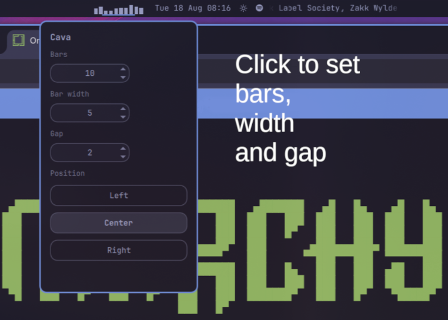

# Cava

Audio visualizer bars for the [Omarchy](https://omarchy.org/) status bar.

Bars use the bar text color from the active theme (`[bar] text` in
`shell.toml`) and follow theme changes. When nothing is playing they
blend into the bar background. Click the widget to change the number of
bars, bar width, and gap.



## Requirements

- [Omarchy](https://omarchy.org/) (Quickshell shell)
- [`cava`](https://github.com/karlstav/cava)

```sh
omarchy pkg add cava
```

## Install

This repository is a marketplace plugin. Add it from git **without**
`--yes` so Omarchy can ask whether to place it on the left, center, or
right of the bar:

```sh
omarchy plugin add https://github.com/<you>/cava.git --enable
```

From a local checkout:

```sh
omarchy plugin add /path/to/cava --enable
```

The installer prompts:

```
Place my.cava in which bar section?
> left
  center
  right
```

You can move it later:

```sh
omarchy bar move my.cava --section center
omarchy bar move my.cava --after omarchy.workspaces
```

## Update

```sh
omarchy plugin update my.cava --yes
```

## Settings

Click the visualizer (or its empty slot when nothing is playing) to open
the menu. From there you can change bars, width, gap, and move Cava to
the left, center, or right of the bar. The same values can be set from
the command line:

| Key | Default | Meaning |
|---|---|---|
| `bars` | `10` | Number of frequency bars |
| `barWidth` | `3` | Thickness of each bar, in pixels |
| `gap` | `2` | Space between bars, in pixels |
| `framerate` | `30` | Cava frames per second |

```sh
omarchy bar set my.cava bars 18
omarchy bar set my.cava barWidth 3
omarchy bar set my.cava gap 2
```

Cava is configured for a 50 Hz–10 kHz range so bass-to-treble scales
across the chosen number of bars. A single `cava` process is shared
across monitors. It uses a private config under
`$XDG_RUNTIME_DIR/my-cava/` and does not touch `~/.config/cava`.

## Remove

```sh
omarchy plugin remove my.cava
```

## License

[MIT](LICENSE)
